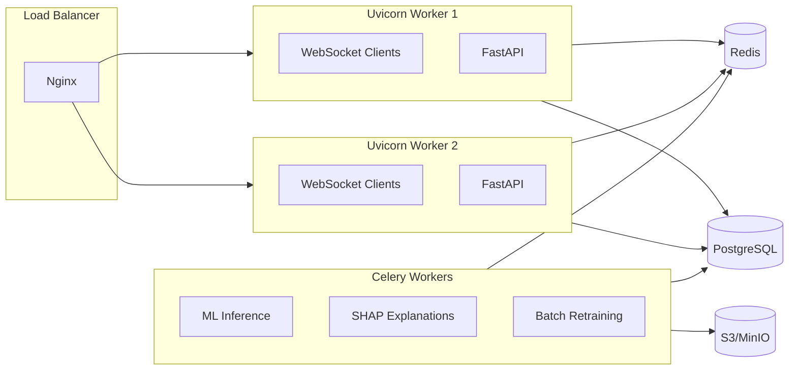
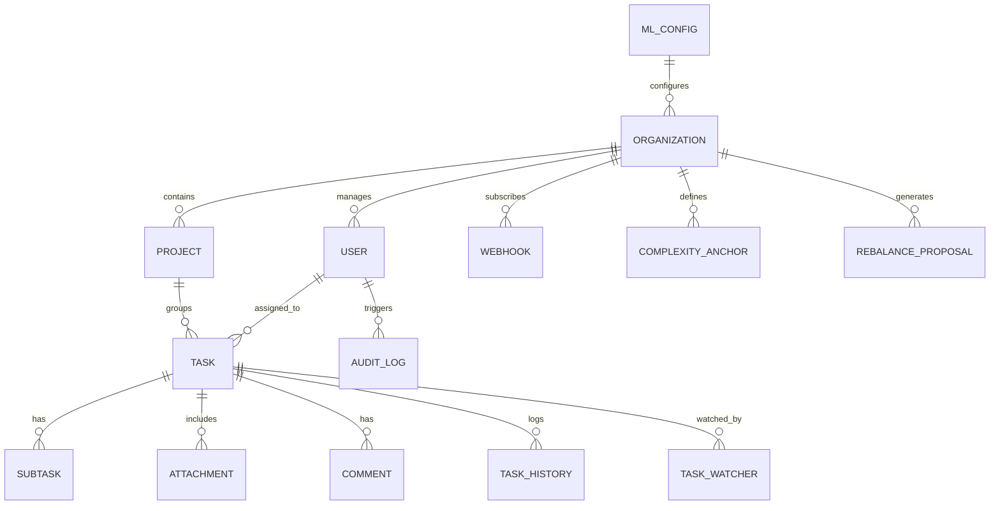

# WATOS: Workload Analysis & Task Optimization System
## Comprehensive Technical & Operational Documentation

WATOS is an enterprise-grade, multi-tenant Warehouse Automation and Tracking Operating System. This document provides an exhaustive overview of the system's architecture, data models, machine learning integration, and operational workflows.

---

## 1. System Vision & Objectives
WATOS is designed to solve the critical challenge of inefficient workload distribution and unpredictable task timelines in warehouse environments.

### Core Pillars:
1.  **Predictive Intelligence**: Using ML to forecast bottlenecks before they happen.
2.  **Operational Visibility**: Real-time transparency for both management and floor staff.
3.  **Scalable Multi-tenancy**: Secure isolation for multiple organizations on a single cluster.
4.  **Auditability**: Complete traceability of every system mutation.

---

## 2. Architecture Deep-Dive

### 2.1 Backend Architecture (`watos-backend`)
Built with a modular, service-oriented design using FastAPI.

-   **API Layer (`app/api/v1`)**: Handles HTTP requests, validation (Pydantic), and response serialization.
-   **Service Layer (`app/services`)**: Encapsulates business logic (e.g., `ml_service`, `notification_service`). API handlers should never talk directly to the DB if complex logic is involved.
-   **ML Pipeline (`app/ml`)**: 
    -   `predictor.py`: Core inference logic using pre-trained models via `ModelStore` abstraction.
    -   `trainer.py`: Scripted retraining logic using `HistGradientBoosting`.
    -   `explainer.py`: Model interpretability using SHAP values.
    -   `model_store.py`: Pluggable storage backend (local filesystem or S3/MinIO).
    -   `auto_feature.py`: Automated feature selection via mutual information scoring.
    -   `tuner.py`: Hyperparameter optimization via `HalvingGridSearchCV`.
-   **Infrastructure (`app/core`)**: Handles global concerns like JWT security, logging, Redis connection, and rate limiting.
-   **Workers (`app/workers`)**: Celery task queue for offloading heavy ML operations from the FastAPI event loop.

### 2.2 Frontend Architecture (`watos-frontend`)
A modern SPA built with React and Vite.

-   **State Management**: 
    -   **Server State**: Managed via `TanStack Query` (React Query) for caching and optimistic updates.
    -   **UI State**: Managed locally via React Context and Hooks.
-   **Component Hierarchy**:
    -   `layout/`: Persistent structures (Sidebar, Error Boundaries).
    -   `shared/`: Reusable logic like `ProjectDetails` and `Profile`.
    -   `pages/`: Role-specific view logic.
-   **Real-time Layer**: Custom `useWebSockets` hook for live event synchronization.

### 2.3 Scaling Architecture


---

## 3. Data Model & Database Schema

### 3.1 Entity Relationship Diagram


### 3.2 Core Models Detailed
#### **Task (`tasks`)**
The central unit of work.
| Field | Type | Description |
| :--- | :--- | :--- |
| `id` | UUID | Primary Key |
| `organization_id` | UUID | Tenant Identifier |
| `status` | String | Enum: `todo`, `in_progress`, `review`, `approved`, `done`, `blocked`, `rejected` |
| `complexity` | Float | Difficulty factor (1-10) used for ML duration prediction |
| `predicted_hours` | Float | Estimated completion time generated by ML |
| `delay_prob` | Float | Probability of missing the `deadline` (0.0 - 1.0) |
| `priority_score` | Float | System-calculated importance based on urgency and risk |
| `shap_explanation`| JSONB | Explanation of why the ML model predicted a delay |

#### **User (`users`)**
System actors with specific roles.
| Field | Type | Description |
| :--- | :--- | :--- |
| `role` | String | `admin` (System), `operator` (Manager), `member` (Staff) |
| `capacity_hours` | Float | Weekly workload capacity (default 40.0) |
| `skills` | ARRAY | List of tags (e.g., "Forklift", "Hazmat") for task matching |

#### **Webhook (`webhooks`)** — *New in v3.0*
| Field | Type | Description |
| :--- | :--- | :--- |
| `url` | Text | Target endpoint URL |
| `secret` | String | HMAC-SHA256 signing secret |
| `events` | ARRAY | Subscribed event types (e.g., `task.status_changed`) |
| `is_active` | Boolean | Auto-disabled after 10 consecutive failures |

#### **ComplexityAnchor (`complexity_anchors`)** — *New in v3.0*
| Field | Type | Description |
| :--- | :--- | :--- |
| `complexity_level` | Float | Reference level (1-10) |
| `label` | String | Human-readable name (e.g., "Simple Pick & Pack") |
| `typical_effort_hours` | Float | Expected effort for this complexity tier |

#### **RebalanceProposal (`rebalance_proposals`)** — *New in v3.0*
| Field | Type | Description |
| :--- | :--- | :--- |
| `task_id` | UUID | Task proposed for reassignment |
| `from_user_id` / `to_user_id` | UUID | Current and proposed assignee |
| `status` | String | `pending` → `approved` → `executed` \| `rejected` |
| `skill_match_score` | Float | Jaccard similarity between task and target user skills |

### 3.3 Data Integrity & Soft Deletes
The system implements **Soft Deletes** on critical entities (`User`, `Task`, `Project`) using the `is_deleted` and `deleted_at` columns. This ensures that historical analytics and audit trails remain intact even if an item is "removed" from the active UI.

---

## 4. Machine Learning Pipeline

### 4.1 Feature Engineering
The system supports both manual and automated feature selection:
-   **Automated Selection** (`auto_feature.py`): Uses mutual information scoring to rank features by predictive power.
-   **Manual Features** (default):
    -   **Workload Utilization**: Sum of assigned effort hours / User capacity
    -   **Complexity Factor**: User-defined difficulty (1.0 - 10.0)
    -   **Temporal Urgency**: 1 / (1 + Days to Deadline)
    -   **Historical Reliability**: 1 - (Delayed Tasks / Total Tasks)

### 4.2 Algorithms & Formulas
-   **Regression (Duration)**: `HistGradientBoostingRegressor` (Scikit-learn).
-   **Classification (Delay)**: `HistGradientBoostingClassifier` (Scikit-learn).
-   **Hyperparameter Tuning** (`tuner.py`): `HalvingGridSearchCV` for efficient parameter search.
-   **Priority Score Formula**:
    $$Score = \alpha \times \text{Urgency} + \beta \times \text{DelayProb} + \gamma \times \frac{\text{Complexity}}{5}$$
    *(Current weights: $\alpha=0.5, \beta=0.3, \gamma=0.2$)*
-   **PERT Distribution**: $E = \frac{O + 4M + P}{6}$

### 4.3 Training Lifecycle
1.  **Bootstrapping**: Synthetic data generation (500 records) on first run if no models exist.
2.  **Incremental Learning**: Every task completion triggers a `partial_fit` simulation to keep weights fresh.
3.  **Batch Retraining**: Full model update every 10 completions, dispatched via Celery workers.

### 4.4 Model Storage
Models are persisted via the `ModelStore` abstraction (`app/ml/model_store.py`):
-   **`LocalStore`** (default): `.joblib` files on local filesystem.
-   **`S3Store`**: For multi-instance deployments using S3/MinIO shared storage.
-   Backend selected via `MODEL_STORE_BACKEND` environment variable.

### 4.5 Confidence Scoring
The `confidence_service` attaches confidence bands to every prediction:
| Completed Tasks | Level | Label | Behavior |
| :--- | :--- | :--- | :--- |
| < 20 | Low | Beta | Predictions shown with caveat |
| 20 – 100 | Medium | Improving | Progress indicator shown |
| > 100 | High | Confident | Full ML features enabled |

### 4.6 Task Clustering (Unsupervised Learning)
WATOS groups tasks dynamically using unsupervised machine learning to facilitate team workload analysis, pattern detection, and anomaly/outlier spotting.

#### **Core Features (Feature Space)**
Clustering is computed in a 3-dimensional feature space (`CLUSTER_FEATURES`):
1.  **Complexity**: Task difficulty score (1.0 to 10.0).
2.  **Effort Hours**: Estimated standard/expected duration hours.
3.  **Priority Score**: Combined score calculated from urgency, complexity, and delay risk.

#### **Algorithm Workflow & Architecture**
1.  **Minimum Constraints**: A minimum of 4 tasks is required to form clusters. If `len(tasks) < 4`, the algorithm assigns all tasks to cluster `0`.
2.  **Normalization**: Missing feature values are filled with `0`. The 3D feature matrix is normalized using Scikit-learn's `StandardScaler` to ensure features with wider ranges (e.g., effort hours vs complexity) do not disproportionately affect distance metrics.
3.  **Density-Based Attempt (DBSCAN)**:
    -   The system first fits a DBSCAN model (`eps=0.5`, `min_samples=3`) on the scaled features.
    -   *Rationale*: Density-based clustering automatically identifies arbitrarily shaped clusters and flags outliers (noise tasks) with a label of `-1`.
4.  **Centroid-Based Fallback (K-Means)**:
    -   If DBSCAN is unable to partition the tasks effectively (i.e. puts all tasks into a single cluster or categorizes all tasks as noise, resulting in a single unique label), the algorithm falls back to K-Means.
    -   **Optimal $k$ Search**: To select the number of clusters $k$ dynamically, the system performs a heuristic elbow analysis (`find_optimal_k`):
        -   Iterates $k$ from `2` to `min(10, number of tasks)`.
        -   Measures model `inertia_` (within-cluster sum of squares) for each $k$.
        -   Computes consecutive inertia differences (`deltas = np.diff(inertias)`) and their ratios (`ratios = deltas[1:] / (deltas[:-1] + 1e-9)`).
        -   Chooses the $k$ that maximizes the ratio of consecutive delta reductions, bounded between `2` and `10`.
        -   Fits the final `KMeans` model with this optimal $k$ and outputs the cluster labels.

#### **Implementation Map (Where it is applied)**
-   **Clustering Engine**: Defined in [`clustering.py`](file:///c:/WATOS/watos-backend/app/ml/clustering.py) (`cluster_tasks` & `find_optimal_k`).
-   **API Endpoint**: Handled by the GET `/api/v1/ml/clusters` router in [`ml.py` (API)](file:///c:/WATOS/watos-backend/app/api/v1/ml.py), returning a structured list of tasks mapped to their current `cluster_id`.
-   **Pydantic Schemas**: `ClusterResponse` is declared in [`ml.py` (Schemas)](file:///c:/WATOS/watos-backend/app/schemas/ml.py).
-   **Database Integration**: 
    -   `cluster_id` is defined as an `Integer` column on the `Task` model in [`task.py` (Model)](file:///c:/WATOS/watos-backend/app/models/task.py).
    -   `clustering` is supported as a tracked model type in `MLModelVersion` in [`ml_model_version.py`](file:///c:/WATOS/watos-backend/app/models/ml_model_version.py).
-   **Frontend Types**: The TypeScript `Task` type in [`index.ts`](file:///c:/WATOS/watos-frontend/src/types/index.ts) contains the optional `cluster_id` property.

---

## 5. Security & Access Control

### 5.1 Authentication Flow
1.  **Login**: User provides email/password.
2.  **Token Issuance**: Server returns a JWT containing `sub` (User ID), `role`, and `org_id`.
3.  **Validation**: `get_current_user` dependency verifies signature and expiration on every request.

### 5.2 Permission Mapping (RBAC)
| Role | Level | Accessible Pages | Permissions |
| :--- | :--- | :--- | :--- |
| **Admin** | System | `/admin/*`, `/operator/*` | Full CRUD, ML Config, Audit Logs, Retraining |
| **Operator** | Management | `/operator/*`, `/projects/*` | Task Assignment, Team Analytics, Project Management |
| **Member** | Execution | `/member/*`, `/profile` | View Own Tasks, Status Updates, Performance Stats |

---

## 6. Functional Module Walkthrough

### 6.1 Frontend Page breakdown
#### **Admin Interface**
- **Admin Home**: Overview of system health, active users, and global task stats.
- **Audit Log**: Searchable/filterable log of all system mutations.
- **ML Config**: Interface for monitoring model performance (MAE, AUC) and triggering retraining.
- **Org Settings**: Manage organization-level defaults.
- **User Management**: Full CRUD for users, password resets, and role/skill management.

#### **Operator Interface**
- **Operator Home**: Dashboard for team progress and immediate bottlenecks.
- **Task Assignment**: Smart assignment tool using priority scores and workload indicators.
- **Task Board**: Drag-and-drop Kanban interface for managing task states.
- **Team Analytics**: Longitudinal performance charts and delay trends.
- **Team Workload**: Granular view of current member utilization.

#### **Member Interface**
- **Member Home**: Personalized view of upcoming deadlines and recent achievements.
- **My Performance**: Personal analytics and completion rates.
- **My Tasks**: Focused list view of current assignments.

---

## 7. User Journeys

### 7.1 Onboarding a New Team Member (Admin Journey)
1. Navigate to **User Management**.
2. Click **Add User**, provide email and set role to `member`.
3. Assign initial **Skills** (e.g., "Picking", "Sorting").
4. System automatically sends invite/welcome notification.

### 7.2 Optimizing Workload (Operator Journey)
1. Review the **Team Workload** chart to identify over-utilized members (red bars).
2. Use **Task Assignment** to identify high-priority unassigned tasks.
3. Drag tasks on the **Task Board** to re-assign or change status based on ML delay warnings.

### 7.3 Resource Leveling (Operator Journey) — *New in v3.0*
1. Navigate to **Resource Leveling** → click **Generate Proposals**.
2. Review proposed task reassignments with utilization impact analysis.
3. Approve or reject each proposal individually.
4. Click **Execute** to apply approved reassignments.

---

## 8. Advanced Technical Concepts

### 8.1 WebSocket Events Reference
| Event | Direction | Payload | Usage |
| :--- | :--- | :--- | :--- |
| `task_updated` | Server -> Client | `TaskResponse` | Syncs Kanban board across all users in Org |
| `notification_new` | Server -> Client | `NotificationData` | Shows real-time toast alerts |
| `ml_retraining_complete` | Server -> Client | `VersionID` | Forces dashboard refresh for new predictions |

### 8.2 WebSocket Scaling Architecture — *New in v3.0*
WebSocket connections are managed via `RedisPubSubManager`:
- Each Uvicorn worker maintains a local dict of connected sockets.
- Messages are published to Redis Pub/Sub channels (`ws:user:{id}`, `ws:org:{id}`).
- Each worker subscribes and delivers only to its local connections.
- Graceful fallback: if Redis is unavailable, local-only delivery continues.

### 8.3 Webhook Integration — *New in v3.0*
**Supported Events**: `task.created`, `task.updated`, `task.status_changed`, `task.assigned`, `task.completed`, `task.deleted`, `project.created`, `project.updated`, `ml.retraining_complete`, `user.created`

**Payload Format**:
```json
{
  "event": "task.status_changed",
  "timestamp": "2026-04-23T12:00:00Z",
  "org_id": "...",
  "data": { "task_id": "...", "old_status": "in_progress", "new_status": "done" },
  "signature": "sha256=..."
}
```

### 8.4 Celery Worker Architecture — *New in v3.0*
Heavy ML operations are offloaded to Celery workers:
- **Queue `ml`**: Model retraining, SHAP explanations, batch predictions.
- **Queue `email`**: Email notifications.
- **Run**: `celery -A app.workers.celery_app worker --loglevel=info -Q ml,email`

### 8.5 Configuration (Environment Variables)
| Variable | Description | Example |
| :--- | :--- | :--- |
| `DATABASE_URL` | Async connection string | `postgresql+asyncpg://...` |
| `SECRET_KEY` | JWT signing key | `long-random-string` |
| `ALLOWED_ORIGINS` | CORS Whitelist | `["http://localhost:5173"]` |
| `ACCESS_TOKEN_EXPIRE_HOURS` | JWT TTL | `8` |
| `REDIS_URL` | Redis connection | `redis://localhost:6379` |
| `MODEL_STORE_BACKEND` | Model storage | `local` or `s3` |
| `S3_BUCKET` | S3 bucket for models | `watos-models` |
| `VAPID_PRIVATE_KEY` | Web Push key | *(generated)* |
| `VAPID_PUBLIC_KEY` | Web Push public key | *(generated)* |

---

## 9. Developer Workflow

### 9.1 Database Migrations
When adding fields to models:
1.  Modify `app/models/*.py`.
2.  Run `alembic revision --autogenerate -m "description"`.
3.  Run `alembic upgrade head`.

### 9.2 Running Tests
- **Backend**: `pytest app/tests`
- **Frontend**: `npm run test`

### 9.3 Running Celery Workers
```bash
celery -A app.workers.celery_app worker --loglevel=info --concurrency=2 -Q ml,email
```

---

## 10. API Reference — New Endpoints (v3.0)

### 10.1 Complexity Calibration
| Method | Endpoint | Description |
| :--- | :--- | :--- |
| `GET` | `/api/v1/complexity/anchors` | List org complexity reference anchors |
| `POST` | `/api/v1/complexity/anchors` | Create a new anchor (admin) |
| `DELETE` | `/api/v1/complexity/anchors/{id}` | Delete an anchor (admin) |
| `POST` | `/api/v1/complexity/suggest` | Get ML-based complexity suggestion |
| `GET` | `/api/v1/complexity/drift` | Detect operator scoring drift (admin) |

### 10.2 Webhooks
| Method | Endpoint | Description |
| :--- | :--- | :--- |
| `GET` | `/api/v1/webhooks/` | List webhooks |
| `POST` | `/api/v1/webhooks/` | Create webhook subscription |
| `PATCH` | `/api/v1/webhooks/{id}` | Update webhook |
| `DELETE` | `/api/v1/webhooks/{id}` | Delete webhook |
| `GET` | `/api/v1/webhooks/events` | List supported event types |
| `POST` | `/api/v1/webhooks/{id}/test` | Send test payload |

### 10.3 Resource Leveling
| Method | Endpoint | Description |
| :--- | :--- | :--- |
| `POST` | `/api/v1/leveling/generate` | Generate rebalancing proposals |
| `GET` | `/api/v1/leveling/proposals` | List proposals (filter by status) |
| `POST` | `/api/v1/leveling/review` | Approve/reject proposals |
| `POST` | `/api/v1/leveling/execute` | Execute approved proposals |

### 10.4 Intelligence & Auto-Assignment — *New in v3.0*
| Method | Endpoint | Description |
| :--- | :--- | :--- |
| `POST` | `/api/v1/intelligence/auto-assign` | Recommend assignee based on skills/availability |
| `POST` | `/api/v1/intelligence/auto-assign/{task_id}` | Auto-assign existing unassigned task |
| `GET` | `/api/v1/intelligence/anomalies` | Detect org-wide operator anomalies |
| `GET` | `/api/v1/intelligence/anomalies/{user_id}` | View specific operator anomalies |

---

## 11. System Limitations — Resolution Status

### 11.1 Technical Constraints — ✅ Resolved
| Limitation | Status | Solution |
| :--- | :--- | :--- |
| In-Memory WebSocket | ✅ **Resolved** | Redis Pub/Sub via `RedisPubSubManager` enables multi-worker scaling |
| Single-Process ML | ✅ **Resolved** | Celery task queue offloads retraining & SHAP to dedicated workers |
| Local Model Files | ✅ **Resolved** | `ModelStore` abstraction supports local + S3/MinIO backends |

### 11.2 Operational Constraints — ✅ Resolved
| Limitation | Status | Solution |
| :--- | :--- | :--- |
| Subjective Complexity | ✅ **Resolved** | Complexity anchors + ML suggestion + drift detection |
| Cold Start Accuracy | ✅ **Resolved** | Confidence scoring with progressive UI disclosure |
| Manual Features | ✅ **Resolved** | `auto_feature.py` + `tuner.py` for automated selection & tuning |

### 11.3 Feature Gaps — ✅ Resolved
| Limitation | Status | Solution |
| :--- | :--- | :--- |
| No Push Notifications | 🔧 **Foundation** | Web Push + PWA service worker infrastructure ready |
| No Integrations | ✅ **Resolved** | Webhook system with HMAC signing + event subscriptions |
| No Resource Leveling | ✅ **Resolved** | Greedy rebalancing engine with approval workflow |
| Manual Assignment | ✅ **Resolved** | Auto-assignment based on `required_skills` and utilization |
| Unknown Anomaly | ✅ **Resolved** | Operator anomaly detection via Z-score statistical process control |

---

## 12. Future Roadmap
-   **External WMS Integration**: Bi-directional sync with Oracle/SAP systems.
-   **Native Jira/Trello Connectors**: Built on top of the webhook foundation.
-   **PWA Offline Mode**: Service worker caching for warehouse floor operations.
